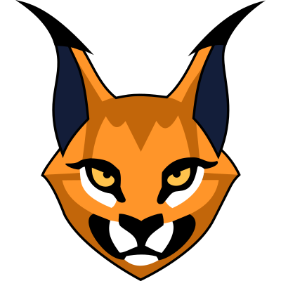

[](https://github.com/arminherling/Caracal/actions/workflows/run-tests-windows-msvc.yaml) [](https://github.com/arminherling/Caracal/actions/workflows/run-tests-windows-clang.yaml) [](https://github.com/arminherling/Caracal/actions/workflows/run-tests-ubuntu-clang.yaml)
# Caracal



> [!NOTE]
> Everything from syntax to semantics is currently work-in-progress and might change at any point.

## Table of Contents
- [Description](#description)
- [Goals](#goals)
- [Roadmap](#roadmap)
- [Examples](#examples)
- Language
  - [Functions](#functions)
  - [Constants](#constants)
  - [Variables](#variables)
  - [Operators](#operators)
  - [Control flow](#control-flow)
    - [Return](#return)
    - [While](#while)
    - [Skip](#skip)
    - [Break](#break)
    - [If](#if)
    - [Trailing if](#trailing-if)
  - [Types](#types)
  - [Enums](#enums)
  - [Variants](#variants)

## Description
Caracal is an imperative, compiled programming language designed with a focus on simple and enjoyable syntax with sensible defaults.
The goal is a statically typed language that feels like a dynamically typed language thanks to type inference.

## Goals
- Good sensible defaults
- Powerful generics
- Low barrier for test integration
- Native compilation
- Maybe not too ugly syntax

## Roadmap
The current focus is on getting a minimal version up and running. For that, I'm generating LLVM IR.

- Lexer: mostly done
- Parser: basic syntax can be parsed but is missing advanced features
- Typechecker: some done
- Optimizer: none yet
- Codegen: some code is already executable

## Examples
Some examples can be found under /Tests/TestData/Input here: [Link](Tests/TestData/Input)


### Functions

Caracal uses the ``def`` keyword to declare functions. Parameters start with the name and then the type, they are immutable by default.

```odin
def square(x: i32) 
{ 
    return x * x;
}
```
We can also declare external C functions with the ``extern`` annotation. This form also supports C's variadic parameters with ``...``.

```odin
#extern()
def puts(message: string) i32 {}

#extern()
def printf(message: string, ...) i32 {}
```


### Constants

To declare constants in Caracal, we use similar syntax to parameters, except we use double colons. They can't be changed during runtime as the name implies. Es can be declared in global scope or function scope.
The type is infered during compilation, but you can use an explicit type.

```odin
// infered type of OS
currentOS :: OS.Windows;

// explicit type of i32
year : i32 : 2026;
```


### Variables

Variables are similar to constants but they can be changed during runtime. We declare them with ``:=``. Unlike constants, variables cant be declared in global scope. We can also state the type explicitly,same as constants.

```odin
def getRandomNumber() i32
{
    // chosen by fair dice roll.
    // guaranteed to be random.
    x := 4;
    return x;
}
```


### Operators
...

### Control flow
...
### Return
...
#### While
...
#### Skip
...
#### Break
...
#### If 
...
### Trailing if
...


### Enums

Enums in Caracal are scoped constants with the same type, they work similar to C/C++.

```odin
enum Values
{
    First :: 1
    Second :: 2
    Third :: 3
}

s :: Values.Second;
```

If the enum has the ``autoIncrement`` annotation, then the first member starts with the value 0, and each successive member has a value one greater than the previous one, unless the value is manually assigned.

```odin
#autoIncrement()
enum Values
{
    First        // 0
    Second :: 5  // 5
    Third        // 6
}
```

The base type of the enum is infered by default but we can also use an explicit type.

```odin
enum Values : i32
{
    First :: 1
    Second :: 2
}
```

### Types

Types are the data objects of the language, they are similar to structs in other languages and can contain fields and methods. Members are accessed with a ``.`` , similar to ``this.`` in other languages.

```odin
type Two
{
    one :: 1
    
    def one() i32
    {
        return .one;
    }

    def value() i32
    {
        return .one() + .one();
    }
}
```

### Variants

Variants, also known as sum types or tagged unions, are Caracal's way to do polymorphism, they allow you to put different types behind a unified interface. They can be extended from multiple files.

